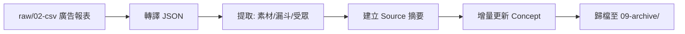

# 🧠 LLM Wiki Starter Kit - Digital ad

> 一鍵初始化符合 [Karpathy LLM Wiki 規範](https://gist.github.com/karpathy/442a6bf555914893e9891c11519de94f) 的 Obsidian 知識庫。
> 本版本專為 **數位廣告分析與行銷洞察** 量身打造，內建能自動解析廣告報表、提取素材標籤與追蹤行銷漏斗的 AI Agent 自動化工作流（Claude Code / Antigravity）。

---

## ✨ 這是什麼？

這是一個**開箱即用的 Obsidian Vault 初始化模板**。它包含：

- 📁 **完整的目錄架構**：raw（原始素材）/ wiki（知識編譯）/ assets（媒體資產）
- 📜 **AI Agent 規則檔案**：賦予 AI「數位廣告數據分析師」的角色，理解行銷漏斗、素材風格與轉換事件。
- 🛠️ **三大核心 Skills**：ingest（攝取）/ query（查詢）/ lint（巡檢）
- 🔗 **雙鏈知識網絡**：自動維護 Obsidian 雙向連結，將廣告活動、素材、成效指標網狀連結，杜絕孤島頁面。

### 設計哲學

```
raw/（不可變層）──→ AI Agent 編譯 ──→ wiki/（知識輸出層）
     唯讀                                  你擁有這裡
```

你只需將廣告報表 (CSV) 或會議紀錄丟進 `raw/`，AI Agent 就會自動提煉、建立實體與概念頁面、維護索引與日誌。

---

## 🚀 快速開始 (安裝教學)

> **重要觀念**：此專案是「安裝包」，不該直接當作日常使用的 Vault。
> 您需要透過以下方法，將核心的 AI 規則展開到您真正的 Obsidian 目錄中。

### 方法一：Agent 魔法安裝精靈（推薦 🌟）

這是最安全且不污染 Obsidian 的方式。

1. **Clone 此儲存庫**到任意暫存位置：
   ```bash
   git clone https://github.com/stubipapa/llm-wiki-starter-kit-digital-ad.git
   ```
2. **啟動 AI Agent**：進入該資料夾，並在終端機啟動 Claude Code 或 Antigravity。
   ```bash
   cd llm-wiki-starter-kit-digital-ad
   claude  # 或使用 Antigravity
   ```
3. **呼叫安裝精靈**：在 Agent 中輸入以下指令：
   ```text
   /scaffold
   ```
4. **互動式部署**：AI 會化身安裝精靈，詢問您的 Obsidian Vault 路徑，確認後便會精準地把大腦規則複製過去（絕不複製本安裝包的 README 或 .git）。
5. **完成！** 安裝完成後，您可以直接刪除這個 `llm-wiki-starter-kit-digital-ad` 資料夾，並前往您的 Obsidian 開始使用。

### 方法二：Shell 腳本安裝

如果您尚未安裝指令碼形式的 AI Agent，可以使用內建腳本：

```bash
git clone https://github.com/stubipapa/llm-wiki-starter-kit-digital-ad.git
bash llm-wiki-starter-kit-digital-ad/scaffold.sh ~/Documents/My-Wiki-Vault
```

### 方法二：複製以下Prompt，丟給Agent處理

```Prompt
請依照以下步驟幫我完成安裝資料：
1.Clone 此儲存庫到此project內：
git clone https://github.com/stubipapa/llm-wiki-starter-kit-digital-ad.git
2.進入該資料夾，並在終端機啟動
cd llm-wiki-starter-kit-digital-ad
3.呼叫安裝精靈：執行以下指令：
/scaffold
4.安裝完後刪除剛剛Clone的安裝資料夾(llm-wiki-starter-kit-digital-ad)
```

---

## 🏗️ 架構原理

### 檔案載入鏈

AI Agent 不會自己知道你的知識庫規則。它靠**入口檔**引導，一步步讀取：

```
Claude Code 啟動
  └→ 自動讀取 CLAUDE.md（平台硬編碼行為）
       └→ 讀取 WIKI_SCHEMA.md
            └→ 成為「數位廣告分析大腦」

Antigravity 啟動
  └→ 自動讀取 .agyrules（平台硬編碼行為）
       └→ 遵守 WIKI_SCHEMA.md
```

### 初始化後的 Vault 結構

```
My-Vault/                          ← 您的 Obsidian Vault
├── CLAUDE.md                      ← Claude Code 入口
├── .agyrules                      ← Antigravity 入口
├── WIKI_SCHEMA.md                 ← 核心規範 (品牌、漏斗、廣告指標定義)
├── .claude/skills/                ← Claude Code 技能
├── .agents/skills/                ← Antigravity 技能
├── raw/                           ← 原始素材收件箱（唯讀）
│   ├── 01-articles/
│   ├── 02-csv/ad_reports/         ← 將 CSV 報表丟這裡
│   ├── 03-json/ad_reports/        ← AI 自動轉換的 JSON
│   ├── 04-clipper/
│   └── 09-archive/                ← 處理完的報表會自動歸檔於此
├── wiki/                          ← 知識編譯輸出區
│   ├── concepts/                  (如：CPM, CTR, 素材風格)
│   ├── entities/                  (如：廣告平台, 產品型號)
│   ├── sources/                   (如：各檔期的報表摘要)
│   ├── syntheses/
│   ├── index.md
│   └── log.md
└── assets/                        ← 媒體資產
```

---

## 🛠️ 內建 Skills

| 指令 | 功能 | 觸發方式 |
|------|------|----------|
| `/ingest` | 廣告數據攝取：將 CSV 自動轉 JSON 並提煉為知識網絡 | `/ingest` |
| `/query` | 本地知識檢索：例如「幫我找過去 CTR 最高的受眾是誰」 | `/query <問題>` |
| `/lint` | 健康巡檢：揪出死鏈、孤島頁面 | `/lint` |

### Digital Ad 特化 Ingest 工作流


---

## 📜 License

MIT License — 自由使用、修改與分享。
