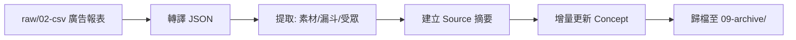

# 🧠 LLM Wiki Starter Kit - Digital ad (V2.1)

> 一鍵初始化符合 [Karpathy LLM Wiki 規範](https://gist.github.com/karpathy/442a6bf555914893e9891c11519de94f) 的 Obsidian 知識庫。
> 本版本專為 **數位廣告分析與行銷洞察** 量身打造，內建能自動解析廣告報表、提取素材標籤與追蹤行銷漏斗的 AI Agent 自動化工作流（Claude Code / Antigravity）。

---

## ✨ V2 全新升級：廣告數據擠水分析 (Squeeze Analysis)
本次 V2 版本導入了強大的「擠水分析」機制，AI 不僅是單純整理報表，更會作為您的公正第三方稽核：
- **第一方數據驗證**：自動將廣告商報告的成效與 GA4 (進站/停留時間)、GTM (實際轉換事件) 交叉比對。
- **灌水檢測紅綠燈**：精準揪出點擊灌水與無效流量，並在知識庫中標上 🔴🟡🟢 信任度燈號。
- **還原真實數據**：自動為您重新計算出「擠水後真實 CTR」與「擠水後真實 CPC」。

## 📊 廣告報表標準模板 (Google Sheet 格式)

請複製以下 CSV 內容並貼上到您的 Google Sheet 第一個儲存格（A1），這將會自動展開為報表格式。之後您只需將此格式下載為 `.csv`，然後放入 `raw/02-csv/ad_reports/` 即可被 AI 正確解析！

```csv
廣告商,（範例：某廣告商）,,,,,,
Campaign 名稱,（範例：H1220-天王排熱水器-Q2）,,保證曝光數,（範例：300000）,,,
廣告總預算,（範例：300000）,,實際曝光數,（範例：300000）,,,
投放平台,（範例：meta）,,預估 CTR,（範例：3%）,,,
廣告開始,（範例：2026/6/9）,,預估點擊數,（範例：300000）,,,
廣告結束,（範例：2026/6/20）,,實際點擊數,（範例：300000）,,,
漏斗階段,（範例：前期、中期、後期、無),,素材種類,（範例：影片）,,,
廣告目標,（範例：曝光）,,素材風格,（範例：3D科幻）,,,
廣告單價,（範例：250）,,計價單位,（範例：CPM）,,,
GA4_有效頁面進站,（範例：300）,,KPI 目標值,"（範例：300,000）",,,
GA4_平均停留時間,（範例：10）,,KPI 實際值,"（範例：300,000）",,,
GTM_實際觸發事件,（範例：200）,,KPI 達成率,（範例：100%）,,,
,,,,,,,
,,,,,,,
,,,,,,,
,,,,,,,
,,,,,,,
DATE,Impression,Click,Engagement,Cost,CTR,ETR,CPE
2025/3/12,"1,304",172,200,"$1,110",13.19%,15.34%,$5.55
2025/3/13,"1,050",108,129,$773,10.29%,12.29%,$5.99
TOTAL,"2,354",280,329,"$1,883",11.89%,13.98%,$5.72
,,,,,,,
,,,,,,,
,,,,,,,
年齡,Impression,Click,Engagement,Cost,CTR,ETR,CPE
25-34,"1,304",172,200,"$1,110",13.19%,15.34%,$5.55
35-44,"1,304",172,200,"$1,110",13.19%,15.34%,$5.55
45-54,"1,050",108,129,$773,10.29%,12.29%,$5.99
TOTAL,"3,658",452,329,NT$0.73,12.36%,0,17
,,,,,,,
,,,,,,,
,,,,,,,
受眾,Impression,Click,Engagement,Cost,CTR,ETR,CPE
興趣貼標,"1,304",172,200,"$1,110",13.19%,15.34%,$5.55
線上足跡追蹤,"1,304",172,200,"$1,110",13.19%,15.34%,$5.55
線下足跡追蹤,"1,304",172,200,"$1,110",13.19%,15.34%,$5.55
自定義關鍵字,"1,304",172,200,"$1,110",13.19%,15.34%,$5.55
電子發票數據,"1,304",172,200,"$1,110",13.19%,15.34%,$5.55
TOTAL,"6,520",860,"NT$1,000",NT$1.16,13.19%,1,28
```

## ✨ 這是什麼？

這是一個**開箱即用的 Obsidian Vault 初始化模板**。它包含：

- 📁 **完整的目錄架構**：raw（原始素材）/ wiki（知識編譯）/ assets（媒體資產）
- 📜 **AI Agent 規則檔案**：賦予 AI「數位廣告數據分析師」的角色，理解行銷漏斗、素材風格與轉換事件。
- 🛠️ **三大核心 Skills**：ingest（攝取）/ query（查詢）/ lint（巡檢）
- 🔗 **雙鏈知識網絡**：自動維護 Obsidian 雙向連結，將廣告活動、素材、成效指標網狀連結，杜絕孤島頁面。
- 📊 **報表模板相容**：內附標準廣告報表 CSV 模板，支援解析帶有「（範例：...）」防呆包裝的數據。

### 設計哲學

```
raw/（不可變層）──→ AI Agent 編譯 ──→ wiki/（知識輸出層）
     唯讀                                  你擁有這裡
```

你只需將廣告報表 (CSV) 或會議紀錄丟進 `raw/`，AI Agent 就會自動提煉、建立實體與概念頁面、維護索引與日誌。

---

## 🚀 快速開始 (安裝教學)

> **重要觀念**：此專案是「安裝包」，不該直接當作日常使用的 Vault。
> 您需要透過以下方法，將核心的 AI 規則展開到您真正的 Obsidian 目錄中。

### 方法一：Agent 魔法安裝精靈

這是最安全且不污染 Obsidian 的方式。

1. **Clone 此儲存庫**到任意暫存位置：
   ```bash
   git clone https://github.com/stubipapa/llm-wiki-starter-kit-digital-ad.git
   ```
2. **啟動 AI Agent**：進入該資料夾，並在終端機啟動 Claude Code 或 Antigravity。
   ```bash
   cd llm-wiki-starter-kit-digital-ad
   claude  # 或使用 Antigravity
   ```
3. **呼叫安裝精靈**：在 Agent 中輸入以下指令：
   ```text
   /scaffold
   ```
4. **互動式部署**：AI 會化身安裝精靈，詢問您的 Obsidian Vault 路徑，確認後便會精準地把大腦規則複製過去（絕不複製本安裝包的 README 或 .git）。
5. **完成！** 安裝完成後，您可以直接刪除這個 `llm-wiki-starter-kit-digital-ad` 資料夾，並前往您的 Obsidian 開始使用。

### 方法二：Shell 腳本安裝

如果您尚未安裝指令碼形式的 AI Agent，可以使用內建腳本：

```bash
git clone https://github.com/stubipapa/llm-wiki-starter-kit-digital-ad.git
bash llm-wiki-starter-kit-digital-ad/scaffold.sh ~/Documents/My-Wiki-Vault
```

### 方法三：複製以下Prompt，丟給Agent處理（推薦 🌟）

```Prompt
請依照以下步驟幫我完成安裝資料：
1.Clone 此儲存庫到此project內：
git clone https://github.com/stubipapa/llm-wiki-starter-kit-digital-ad.git
2.進入該資料夾，並在終端機啟動
cd llm-wiki-starter-kit-digital-ad
3.呼叫安裝精靈：執行以下指令：
/scaffold
4.安裝完後刪除剛剛Clone的安裝資料夾(llm-wiki-starter-kit-digital-ad)
```

---

## 🏗️ 架構原理

### 檔案載入鏈

AI Agent 不會自己知道你的知識庫規則。它靠**入口檔**引導，一步步讀取：

```
Claude Code 啟動
  └→ 自動讀取 CLAUDE.md（平台硬編碼行為）
       └→ 讀取 WIKI_SCHEMA.md
            └→ 成為「數位廣告分析大腦」

Antigravity 啟動
  └→ 自動讀取 .agyrules（平台硬編碼行為）
       └→ 遵守 WIKI_SCHEMA.md
```

### 初始化後的 Vault 結構

```
My-Vault/                          ← 您的 Obsidian Vault
├── CLAUDE.md                      ← Claude Code 入口
├── .agyrules                      ← Antigravity 入口
├── WIKI_SCHEMA.md                 ← 核心規範 (品牌、漏斗、廣告指標定義)
├── .claude/skills/                ← Claude Code 技能
├── .agents/skills/                ← Antigravity 技能
├── raw/                           ← 原始素材收件箱（唯讀）
│   ├── 01-articles/
│   ├── 02-csv/ad_reports/         ← 將 CSV 報表丟這裡
│   ├── 03-json/ad_reports/        ← AI 自動轉換的 JSON
│   ├── 04-clipper/
│   └── 09-archive/                ← 處理完的報表會自動歸檔於此
├── wiki/                          ← 知識編譯輸出區
│   ├── concepts/                  (如：CPM, CTR, 素材風格)
│   ├── entities/                  (如：廣告平台, 產品型號)
│   ├── sources/                   (如：各檔期的報表摘要)
│   ├── syntheses/
│   ├── index.md
│   └── log.md
└── assets/                        ← 媒體資產
```

---

## 🛠️ 內建 Skills

| 指令 | 功能 | 觸發方式 |
|------|------|----------|
| `/ingest` | 廣告數據攝取：將 CSV 自動轉 JSON 並提煉為知識網絡 | `/ingest` |
| `/query` | 本地知識檢索：例如「幫我找過去 CTR 最高的受眾是誰」 | `/query <問題>` |
| `/lint` | 健康巡檢：揪出死鏈、孤島頁面 | `/lint` |

### Digital Ad 特化 Ingest 工作流


---

## 📜 License

MIT License — 自由使用、修改與分享。
